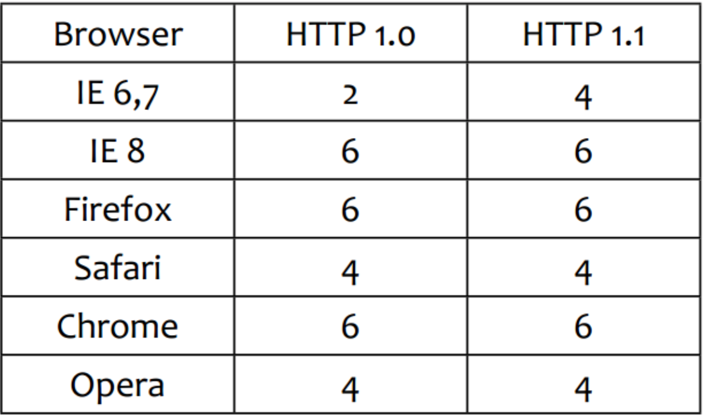

# 序言
从写C#到写JS也有三年左右了，其间遇到过很多挫折，也有很多成长。趁现在公司不太忙，总结下自己积累的一些知识。
# 浏览器
## 请求
### DNS
   从浏览器窗口输入一个URL，首先浏览器会查找本地DNS缓存缓存，如果没有，会请求DNS服务器，进行域名解析。如果想页面中有链接或者其他资源链接想要预先解析DNS可以使用`link`标签来强制预解析DNS，如：```<link rel="dns-prefetch" href="https://www.github.com/">```，这将加快网站资源的加载性能。更多有关DNS相关知识：https://developer.mozilla.org/zh-CN/docs/Controlling_DNS_prefetching
### 网络请求相关
#### 减小带宽
   我们知道Http底层是基于TCP/IP的，一次IP报文最大长度为65535字节，而减少传输量对网站性能至关重要。
* 服务器开启gzip:服务器会把Response的body部分使用zip算法压缩，减少内容传输。目前大部分浏览器器都支持gzip。NodeJS Http Server中可以使用 `compression`包来压缩，具体使用方法请参阅：https://www.npmjs.com/package/compression
* 图片压缩：网页中，一张jpg、png的图片往往几百KB，甚至于几兆。大大占用了带宽。其实大部分的图片都是有压缩空间的，我们从PS切图得到的图片
往往有50%甚至更高的压缩空间。图片压缩可以大大减少往来传输时间。推荐两个在线压缩图片的地址：http://optimizilla.com/zh/ 、 https://tinypng.com/，
都是无损压缩，一张图片可以两个网站都minify下哦。

#### 减少网络请求
一次TCP/IP的请求是要经过三次握手和四次挥手的动作的。并且浏览器同事发送的请求也是有限制的，见下图：
> 
>

  因此减少http请求对提高性能来说有着至关重要的影响。
  
* 合并JS：对网页加载完毕就要马上执行的JS，可以合并成一个JS文件，减少频繁网络请求。
* 使用雪碧图（Sprite）：对网站经常使用图片类型的图标，可以合并成一张图片，使用`background-position`属性来显示不同的图标。
* JS加载：浏览器同时的http请求是有限制的，有一些模块的JS并不是页面加载完毕就要马上运行的，因此我们可以在windows的onload事件中来加载这一部分JS代码。
当然我们也可以在`script`标签中使用defer，添加defer属性的标签将在页面的DOMContentLoaded事件后去加载。现代的前端工程化已经做到了按需加载，当需要某一部分JS或者HTML片段的时候
再去服务器加载。
PS:DOMContentLoaded事件是指浏览器html结构物已经加载完毕，但不保证其他资源（如：image,video,页面内嵌ifarme）等加载完毕。JQuery的ready利用该事件实现。
而onload事件则是页面所有资源都已加载完毕.

####缓存
 
* 服务器缓存：服务器可以把经常请求的文件或者模板存入内存中，避免频繁从磁盘读取的IO操作所消耗的性能和时间。
 